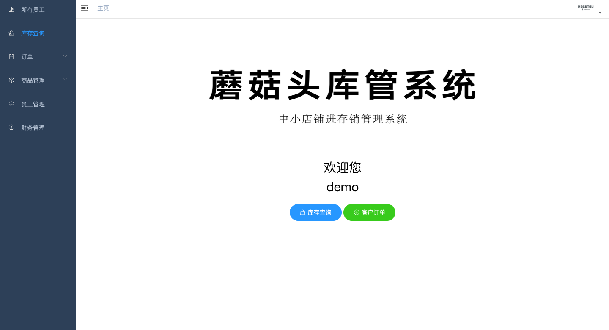
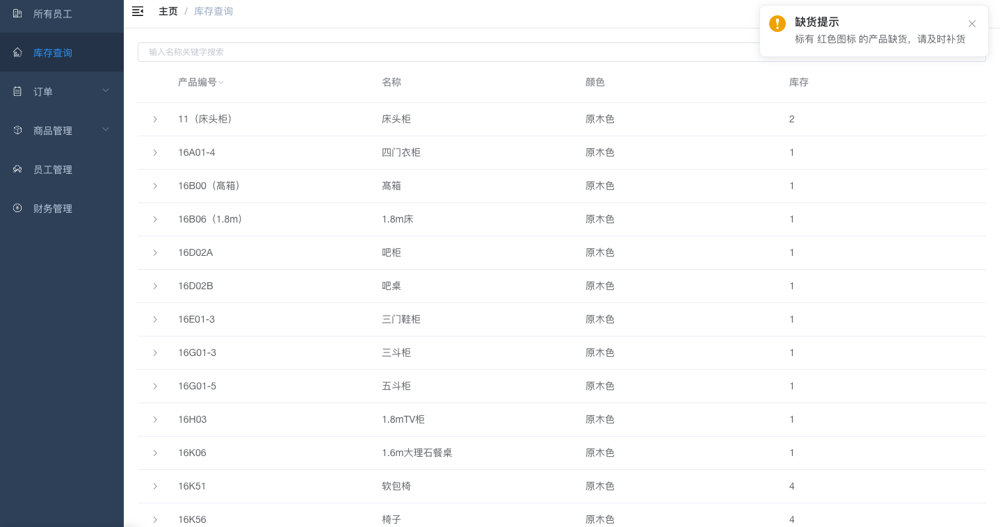
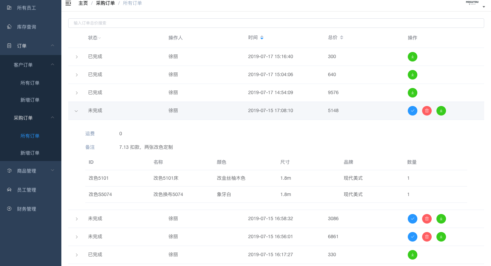
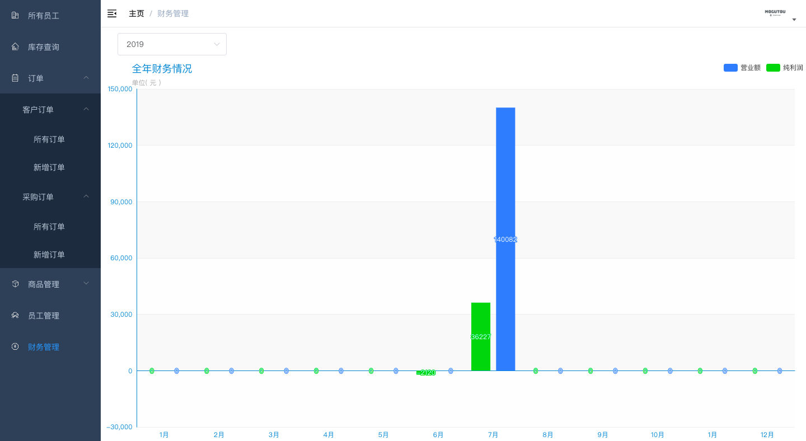
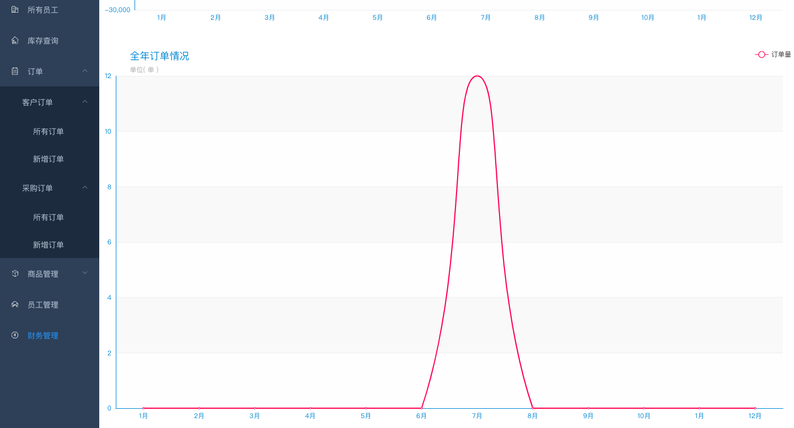

# 蘑菇头进存销管理系统 (mogutouERP)

[](https://goreportcard.com/report/github.com/Allenxuxu/mogutouERP)
[](https://app.codacy.com/app/Allenxuxu/mogutouERP?utm_source=github.com&utm_medium=referral&utm_content=Allenxuxu/mogutouERP&utm_campaign=Badge_Grade_Dashboard)

## 项目介绍

mogutouERP 是一个前后端分离的微型进存销管理系统，采用 Gin + Vue 开发。本仓库包含完整的前端和后端代码。

- 后端：Go语言 + Gin框架 + GORM
- 前端：Vue.js + Element UI

## 主要功能

- 员工账号管理
- 采购订单管理
- 销售订单管理
- 商品信息、库存管理
- 财务信息报表

> 财务信息，添加员工，商品进价管理等操作只有管理员账号可以查看并操作

## 效果图







## 快速开始

### 使用 Docker Compose 启动（推荐）

本项目提供了完整的 Docker 配置，可以一键启动整个系统：

```bash
# 克隆仓库
git clone https://github.com/freecodetiger/mogutou.git
cd mogutou

# 启动所有服务
docker-compose up -d

# 查看服务状态
docker-compose ps

# 查看服务日志
docker-compose logs -f
```

启动后可以通过以下地址访问：
- 前端界面：http://localhost:9528
- 后端API：http://localhost:1988/api/v1

### 手动启动

#### 1. 后端

准备一个 MySQL 数据库，可以本地安装或使用 Docker：

```bash
# 使用 Docker 启动 MySQL
docker run --name mysql -e MYSQL_ROOT_PASSWORD=ircnjfdhnvxwz. -e MYSQL_DATABASE=mgt -p 3307:3306 -d mysql:5.7
```

进入后端目录并启动服务：

```bash
cd mogutouERP-master

# 修改配置文件（如需要）
vi conf/conf.json

# 启动后端服务
go build -o mogutou main.go router.go
./mogutou -c conf/
```

#### 2. 前端

进入前端目录并启动服务：

```bash
cd mogutouERP-vue

# 安装依赖
npm install

# 开发模式启动
npm run dev

# 或构建生产版本
npm run build
```

前端开发服务器将在 http://localhost:9528 上运行。

### 登录系统

默认管理员登录账号和密码都是 **11223344556**，登录后建议立即修改密码。

## 部署指南

### 后端部署

#### 数据库配置

后端数据存储使用 MySQL 数据库，需要提前在 MySQL 中建库，数据库名称随意定义，只需与配置文件中一致即可。无需提前建表，项目中采用 GORM 自动生成。

#### 配置文件

在服务器上创建一个目录存放配置文件，并创建两个配置文件：

```bash
mkdir -p /opt/mogutouERP/conf
touch /opt/mogutouERP/conf/conf.json /opt/mogutouERP/conf/jwt.json
```

配置文件内容模板：

conf.json
```json
{
    "mysql": {
        "name": "root",
        "password": "ircnjfdhnvxwz.",
        "DBname": "mgt",
        "addr": "mysql:3306"
    },
    "listen": "0.0.0.0:1988"
}
```

jwt.json
```json
{
    "jwt-key": "your-secret-key"
}
```

#### Docker 部署

```bash
# 构建后端镜像
docker build -t mogutou-backend -f mogutouERP-master/Dockerfile.backend mogutouERP-master/

# 运行后端容器
docker run --name mogutou-backend -v /opt/mogutouERP/conf:/app/conf -p 1988:1988 --network mogutou-network -d mogutou-backend
```

### 前端部署

#### 生产环境配置

修改前端配置文件以指向正确的后端API地址：

```bash
# 编辑 prod.env.js
vi mogutouERP-vue/config/prod.env.js
```

```javascript
'use strict'
module.exports = {
  NODE_ENV: '"production"',
  BASE_API: '"https://your-domain.com/api/v1"'
}
```

#### 构建与部署

```bash
# 进入前端目录
cd mogutouERP-vue

# 安装依赖
npm install

# 构建生产版本
npm run build

# 将生成的 dist 目录部署到 Web 服务器
```

#### Nginx 配置示例

```nginx
server {
    listen 80;
    server_name your-domain.com;

    root /path/to/mogutouERP-vue/dist;
    index index.html;

    location / {
       try_files $uri $uri/ /index.html;
    }

    location /api {
       proxy_pass http://localhost:1988;
    }
}
```

## 团队协作开发

为了方便团队成员协同开发，建议采用以下工作流程：

### 1. 使用Git进行版本控制

```bash
# 克隆仓库
git clone https://github.com/freecodetiger/mogutou.git

# 创建功能分支
git checkout -b feature/new-feature

# 提交更改
git add .
git commit -m "Add new feature"

# 推送到远程仓库
git push origin feature/new-feature
```

### 2. 代码审查流程

1. 开发者在功能分支上完成开发
2. 创建Pull Request请求合并到主分支
3. 团队成员进行代码审查
4. 解决审查中提出的问题
5. 合并到主分支

## 许可证

本项目基于 MIT 许可证开源。

## 贡献

欢迎提交问题和功能请求！如果您想贡献代码，请先创建一个issue讨论您想要更改的内容。
